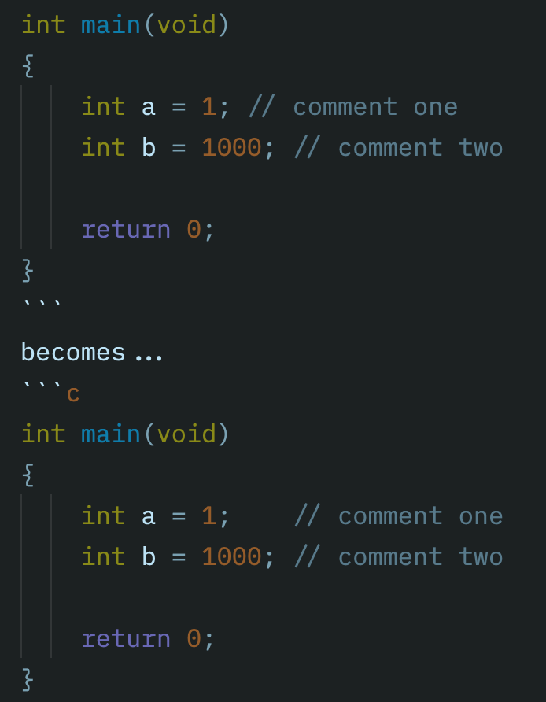

# Align Comments

This CLI tool will look for lines with trailing comments, and if they are near one another, will align the comments to start at the same column. 

## Example

(Writing a code example here does not show the difference very well since Markdown can be rendered in different ways.)

